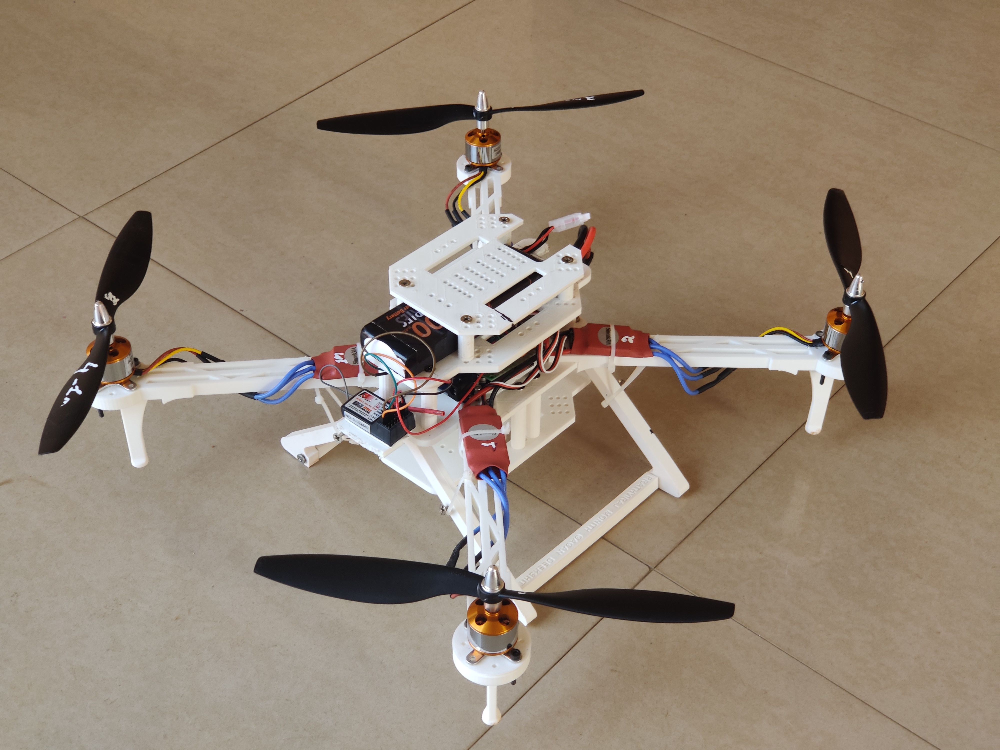

# 3D-printed-Quadcopter's
3D printed Ardunio and Stm32 based quadcopter 

# ARDUNIO UNO
|  |  |
| --------------------------- | --------------------------- |

# STM32
|  |  |
| --------------------------- | --------------------------- |

# ARDUNIO NANO PCB
|  |
